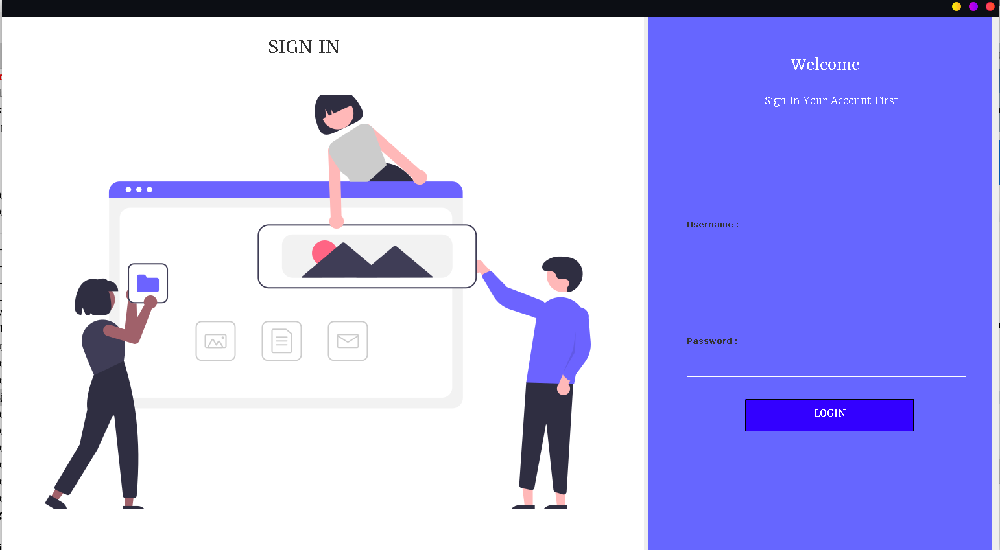
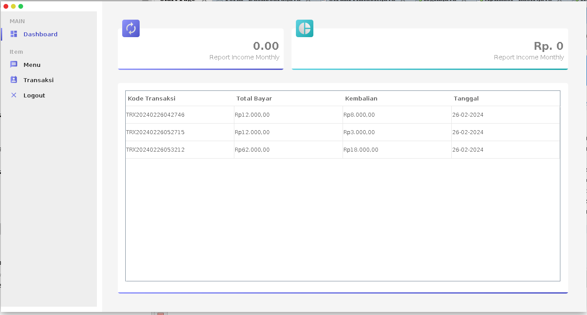

# Cashier App Java Netbeans

## Features: 
- **Login and Logout User**
- **User Roles (Admin and Cashier)**
- **Validation and Duplicate Input Data**

## Screenshots
### Login Page

### Dashboard

# Styling
Welcome to our Cashier Application! This is a simple application designed to facilitate sales and inventory management.

**How to Use:**
1. Open the application using NetBeans.
2. Log in with your account.
3. Choose your role (Admin or Cashier).
4. Start managing transactions and inventory.

Thank you for using our Java Netbeans Cashier App!

